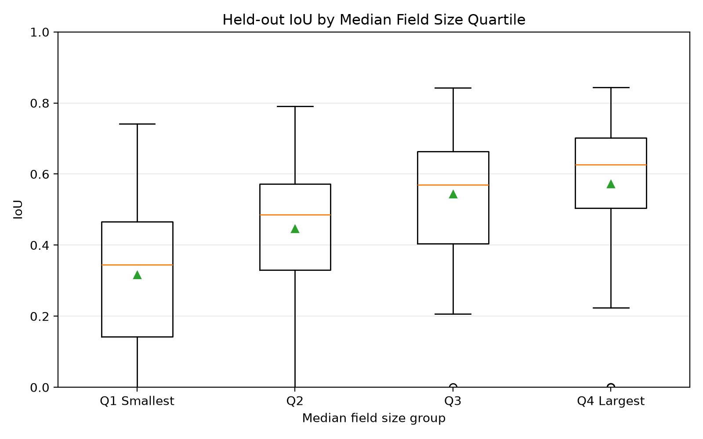
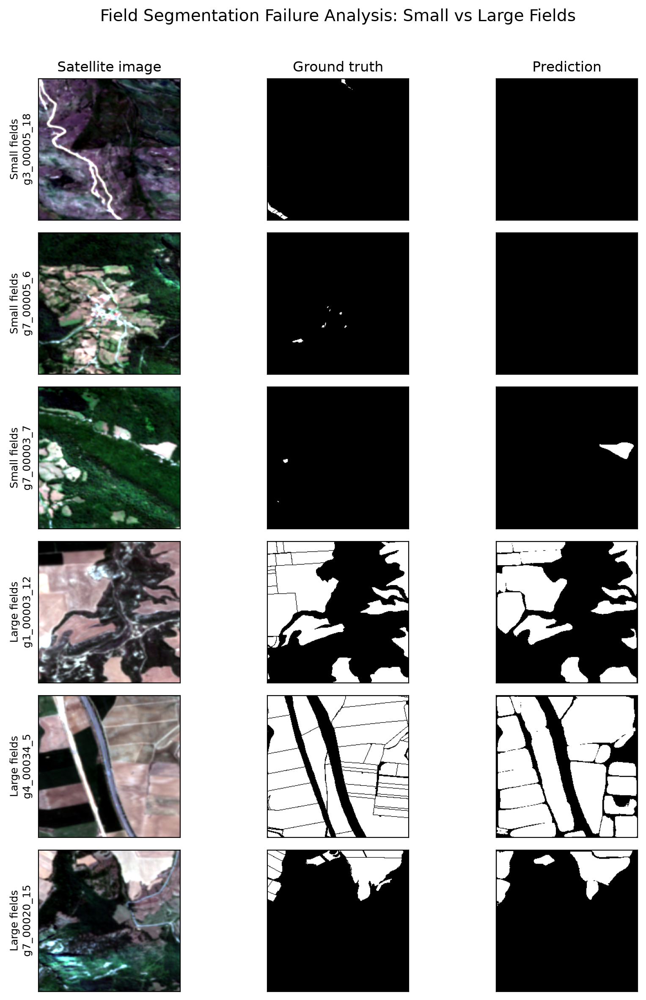

# Results and Error Analysis

## 1. Held-Out Test Performance

The final Mask R-CNN baseline was evaluated on an independent held-out test
set of **216 image tiles**.

Prediction/test pairing was validated before evaluation:

- Test tiles: 216
- Prediction sets: 216
- Pairing problems: 0
- Status: PASS

### Overall metrics

| Metric | Value |
|---|---:|
| Mean IoU | 0.4938 |
| Median IoU | 0.5122 |
| Std IoU | 0.2525 |
| Mean Precision | 0.8321 |
| Mean Recall | 0.5115 |
| Mean F1 / Dice | 0.6551 |

Additional test-set counts:

- Empty ground-truth tiles: 15
- Empty prediction tiles: 27

Precision was substantially higher than recall. This indicates that predicted
field regions were generally reliable when detected, while missed field area
and under-detection were more prominent than excessive false positives.

---

## 2. Performance Heterogeneity

Performance varied substantially across the held-out test set.

The IoU standard deviation of **0.2525** indicates considerable variation
between tiles, motivating analysis of whether agricultural landscape
morphology was associated with this performance variation.

Morphology QC produced valid summaries for:

**197 / 216 held-out tiles**

The remaining 19 tiles consisted of:

- 15 tiles with empty ground truth
- 4 tiles where no complete morphology-valid field survived QC

Morphology-performance analyses therefore use the **197-tile valid subset**.

---

## 3. Morphology and Segmentation Performance

Spearman rank correlations were calculated between tile-level IoU and
chip-level morphology summaries.

| Morphology variable | Spearman ρ with IoU |
|---|---:|
| Median field area | **+0.478** |
| Median compactness | +0.121 |
| Median shape complexity | -0.137 |
| Number of morphology-valid fields | -0.123 |

Median field area showed the strongest observed association with segmentation
performance.

The other morphology variables showed substantially weaker relationships
with IoU in this experiment.

---

## 4. Field-Size Quartile Analysis

The 197 morphology-valid held-out tiles were divided into quartiles according
to median field area.

| Field-size group | Tiles | Median field area (ha) | Mean IoU | Median IoU |
|---|---:|---:|---:|---:|
| Q1 — Smallest | 50 | 0.114 | 0.317 | 0.345 |
| Q2 | 49 | 0.259 | 0.446 | 0.485 |
| Q3 | 49 | 0.466 | 0.544 | 0.570 |
| Q4 — Largest | 49 | 1.055 | 0.573 | 0.626 |

Mean IoU increased monotonically across the field-size quartiles:

**0.317 → 0.446 → 0.544 → 0.573**

For this three-epoch Spain baseline, segmentation performance was therefore
substantially lower in landscapes dominated by smaller fields.

---

## 5. Qualitative Failure Analysis

Representative small- and large-field tiles were compared using satellite
imagery, ground-truth masks, and model predictions.

Small-field examples showed more missed detections and weaker recovery of
small or fragmented field regions.

Large-field examples generally showed stronger spatial agreement between
ground truth and predictions, although segmentation and boundary errors
remained.

These examples are consistent with the quantitative field-size pattern, but
are used as qualitative illustrations rather than independent statistical
evidence.

---

## 6. Interpretation and Limitations

The held-out evaluation indicates that segmentation performance was not
uniform across the Spain case study.

Among the tested morphology variables, field size showed the clearest
association with segmentation quality:

**Spearman ρ = +0.478**

The quartile analysis was consistent with this relationship, with mean IoU
increasing from **0.317** in the smallest-field quartile to **0.573** in the
largest-field quartile.

This relationship should be interpreted as an **association, not a causal
effect**.

Possible contributors include:

- pixel and object-scale effects
- small-object representation
- limited three-epoch training
- model architecture
- landscape complexity
- regional or dataset characteristics
- interactions between these factors

The experiment did not isolate these mechanisms.

The three-epoch training configuration is a compute-conscious baseline rather
than an optimized model benchmark. Therefore, the extent to which additional
training or tuning would change the observed small-field performance gap is
unknown.

Results are specific to the FTW Spain case study and the model/configuration
used here. Cross-country generalization was not tested.

---

## Key Finding

> For this three-epoch FTW Spain baseline, segmentation performance was
> substantially lower in landscapes dominated by smaller agricultural fields.

The main analytical result is therefore not simply the overall test accuracy,
but the observed **morphology-dependent variation in model performance**.